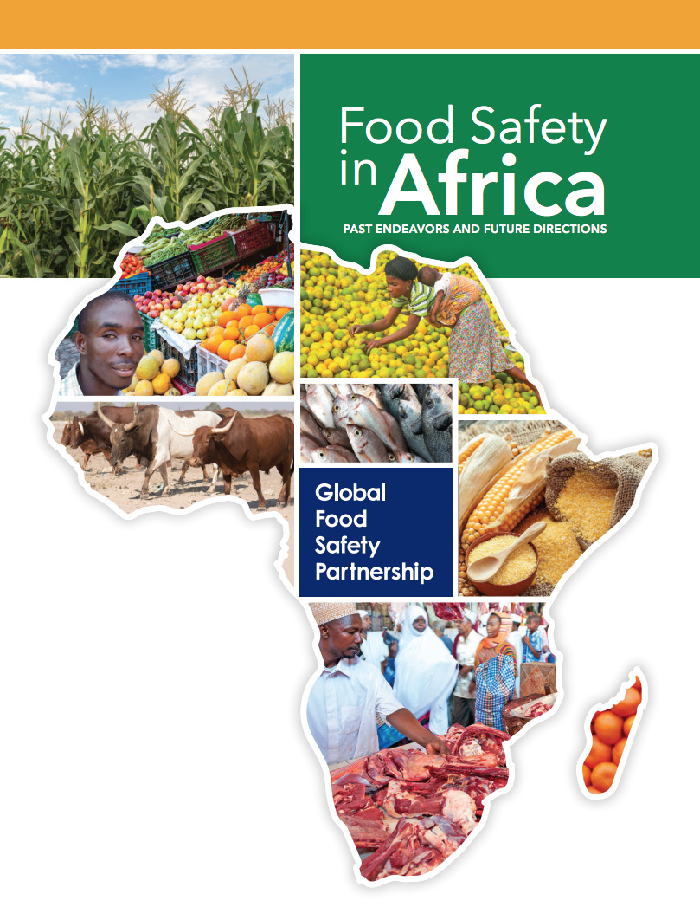

# Food-Safety-in-Africa

## Quick Access
* [Full-Page Version](https://github.com/twyunting/Food-Safety-in-Africa/blob/master/Food_safety_in_Africa_final.pdf)
* [Kaggle](https://www.kaggle.com/dcyunting/food-safety-in-africa)

## Introduction
Food insecurity is still a major global concern as 1 billion people are suffering from starvation and malnutrition, and the Food and Agriculture Organization of the United Nations (FAO) has concluded that we are still far from reaching millennium development goal (MDG) Number 1: to halve extreme poverty and hunger. Especially in sub-Saharan Africa, where the number of people suffering from hunger is estimated at over 200 million, and this figure could increase in the near future. In this project, we hope to answer certain questions with the data set we have and proffer possible solutions to bring about better Food security in Africa. We know Africa has rich resources when it comes to agriculture and rich soil, but they lack the proper equipment to harvest them is lacking. After this, we should be able to comfortably suggest measures to counter the gaping holes in infrastructure, food supply, hazard control, and questions that need answering.

The analysis is based on Global Food Safety Partnerships (GFSP) dataset from 49 countries between 2006 to 2017. We are interested in quantitative measurement for this project, especially we compared Africa's GDP and total population.

## Discussion
  The project of Food Safety in Africa did not magnificently help the Africa population increasing. Therefore, it is recommended that Africa not focus on projects that are not directly linked to food, such as employee training, because this does not play a positive role in their food growth. The investment in food is conducive to the GDP growth of relevant countries.
  However, if you directly invest money in food, you can increase crop output, stimulate people to increase food consumption, and thus steadily increase GDP. According to the country's level and conditions, it is necessary to formulate a strategy that adapts to its own country. African countries can increase their investment in food and reduce disasters, thereby increasing food production and solving Africa's food problems.
  
## References
* Breman, H., & Debrah, S. (2003). Improving African food security. *SAIS Review, 23(1), 153-170.*
  + *Artilce for our reference.*
* Food Safety in Africa: Past Endeavors and Future Directions.(2019, February 5). Retrieved from <https://datacatalog.worldbank.org/dataset/food-safety-africa-past-endeavors-and-future-directions>
  + *This data is the open-source from The World Bank Group collected. The Global Food Safety Partnership's (GFSP) Food Safety in Africa provides an approach to illustrative information on 518 food safety investments in sub-Saharan Africa from 2010 to early 2017.*
* List of sovereign states and dependent territories in Africa. (2020, April 27). Retrieved from <https://en.wikipedia.org/wiki/List_of_sovereign_states_and_dependent_territories_in_Africa>
  + *Africa Countries renamed.*
* Lovelace, R., Nowosad, J., & Muenchow, J. (2020, April 21). Chapter 8: Making maps with R. Retrieved from <https://geocompr.github.io/geocompkg/articles/solutions08.html>
  + *How to create Africa map with the existing dataset.*
* Mwaniki, A. (2006). Achieving food security in Africa: Challenges and issues. *UN Office of the Special Advisor on Africa (OSAA).*
  + *Artilce for our reference.*
* New GFSP Report Quantifies Food Safety Investment in sub-Saharan Africa. (n.d.). Retrieved from <https://www.gfsp.org/new-gfsp-report-quantifies-food-safety-investment-sub-saharan-africa>
  + *Global Food Safety Partnership's website was announced the official information for this data frame. We can download reading guide via this association.*
* UNdata | explorer. (n.d.). Retrieved from <http://data.un.org/Explorer.aspx?d=PopDiv>
  + *Get some quantitative data such as death rates or total population for the countries.*
